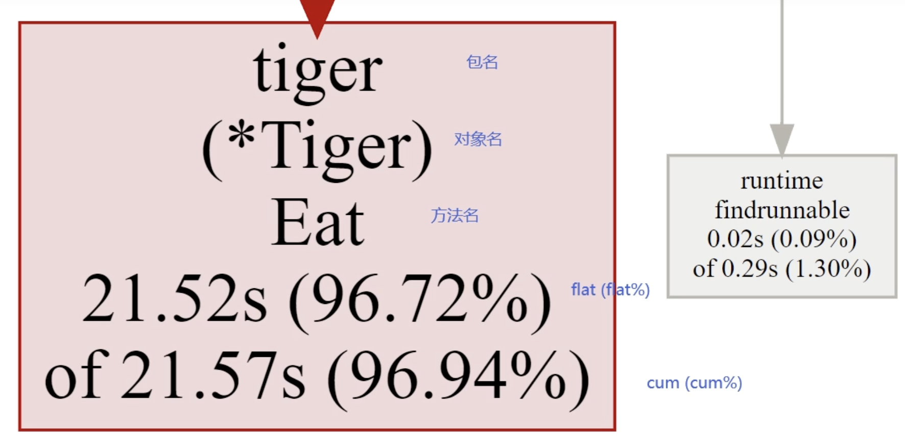
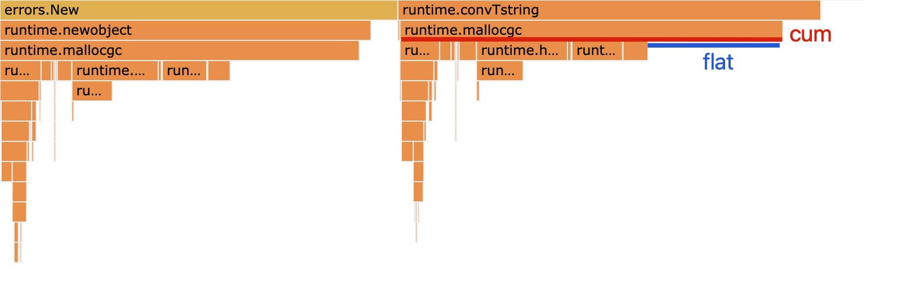

# pprof 的学习使用

- [pprof 的学习使用](#pprof-的学习使用)
  - [1. 参考链接](#1-参考链接)
  - [2. 说明](#2-说明)
  - [3 pprof 工具使用](#3-pprof-工具使用)
    - [3.1 net/http/pprof 使用](#31-nethttppprof-使用)
    - [3.2 runtime/pprof 工具使用](#32-runtimepprof-工具使用)
  - [4. 通过 pprof 分析相关信息](#4-通过-pprof-分析相关信息)
    - [4.1 通过监听端口利用web进行分析](#41-通过监听端口利用web进行分析)
    - [4.2 通过监听端口利用web进行分析](#42-通过监听端口利用web进行分析)
    - [4.3 理解参数指标](#43-理解参数指标)

## 1. 参考链接

- https://wallenotes.github.io/2020/04/05/编程/调试/how-to-use-go-pprof/
- https://blog.wolfogre.com/posts/go-ppof-practice/
- net/http/pprof
  - https://zhuanlan.zhihu.com/p/396363069
- graphviz 下载地址
  - https://graphviz.org/download/

## 2. 说明

- pprof 是 go 语言中分析程序运行时资源消耗或占用的有力工具
- 主用用于分析 CPU,Memory,Block,Goroutine
  - CPU profile: 报告程序的 CPU 使用情况，按照一定频率去采集应用程序在 CPU 和寄存器上面的数据
  - Memory Profile（Heap Profile）: 报告程序的内存使用情况
  - Block Profiling: 报告 goroutines 不在运行状态的情况，可以用来分析和查找死锁等性能瓶颈
  - Goroutine Profiling: 报告 goroutines 的使用情况，有哪些 goroutine，它们的调用关系是怎样的
- go 语言提供了 net/http/pprof 和 runtime/pprof 两个库
  - net/http/pprof
    - 在 pprof.go 文件中默认包含路由(/debug/pprof/，/debug/pprof/cmdline，/debug/pprof/profile，/debug/pprof/symbol，debug/pprof/trace)
    - runtime/pprof
- 查看图形界面需要安装
  - centos: yum install -y graphviz
  - ubuntu: sudo apt install -y graphviz

## 3 pprof 工具使用

### 3.1 net/http/pprof 使用

- 准备代码
    > [制作测试代码](./web/http.go)
    > [制作调用脚本](./web/call.sh)

- 启动http服务
    > go run http.go

- 获取样本数据(需要在样本数据获取过程中不停的调用应用程序，参考[调用脚本](./web/call.sh)
    > 浏览器: http://127.0.0.1:8001/debug/pprof/profile?debug=1
    > 命令行: curl http://127.0.0.1:8001/debug/pprof/profile?debug=1 -o pprof.log
    > 性能测试: go test -bench=. -cpuprofile=cpu.prof -memprofile=mem.prof

### 3.2 runtime/pprof 工具使用

- 准备代码
    > [制作测试代码](./cmd/main.go)

- 启动代码，在代码中将直接生成 cpu.log 和 mem.log(直接对这两个文件进行pprof分析)
    > go run main.go

## 4. 通过 pprof 分析相关信息

### 4.1 通过监听端口利用web进行分析

- web界面链接介绍
  - allocs: 查看过去所有内存分配的样本
  - block: 查看导致阻塞同步的堆栈跟踪
  - cmdline: 当前程序的命令行的完整调用路径
  - goroutine: 查看当前所有运行的 goroutines 堆栈跟踪
  - heap: 查看活动对象的内存分配情况
  - mutex: 查看导致互斥锁的竞争持有者的堆栈跟踪
  - profile: 默认进行 30s 的 CPU Profiling，得到一个分析用的 profile 文件
  - threadcreate: 查看创建新 OS 线程的堆栈跟踪

```bash
# 执行以下命令后会直接打开浏览器进行分析
go tool pprof -http=:8801 http://127.0.0.1:8001/debug/pprof/profile
go tool pprof -http=:8802 profile
go tool pprof -http=:8803 pprof.log
```

### 4.2 通过监听端口利用web进行分析

- 工具面板中常用命令
  - top: 列出占用资源最多的函数, 可在top后跟数字，表示列出的数量, top默认列出10个数据
  - web: 输出一个svg的图片，并打开浏览器进行分析， 需要安装 graphviz
  - list funcName: 可查看对应函数源码位置

```bash
# 自动下载数据到本地，然后供你分析
go tool pprof http://localhost:8001/debug/pprof/profile
go tool pprof http://localhost:8001/debug/pprof/heap
go tool pprof http://localhost:8001/debug/pprof/block
# 分析已经下载的文件
go tool pprof pprof.log
```

- 命令行示例

```bash
> go tool pprof pprof.log
File: __debug_bin
Type: cpu
Time: Feb 6, 2023 at 4:15pm (CST)
Duration: 30.14s, Total samples = 7.85s (26.05%)
Entering interactive mode (type "help" for commands, "o" for options)
(pprof) top
Showing nodes accounting for 7.75s, 98.73% of 7.85s total
Dropped 40 nodes (cum <= 0.04s)
Showing top 10 nodes out of 67
      flat  flat%   sum%        cum   cum%
     6.79s 86.50% 86.50%      7.02s 89.43%  main.business
     0.40s  5.10% 91.59%      0.40s  5.10%  runtime.futex
     0.32s  4.08% 95.67%      0.32s  4.08%  runtime/internal/syscall.Syscall6
     0.23s  2.93% 98.60%      0.23s  2.93%  runtime.asyncPreempt
     0.01s  0.13% 98.73%      0.04s  0.51%  runtime.findRunnable
         0     0% 98.73%      0.09s  1.15%  bufio.(*Reader).ReadLine
         0     0% 98.73%      0.09s  1.15%  bufio.(*Reader).ReadSlice
         0     0% 98.73%      0.09s  1.15%  bufio.(*Reader).fill
         0     0% 98.73%      0.28s  3.57%  bufio.(*Writer).Flush
         0     0% 98.73%      0.19s  2.42%  internal/poll.(*FD).Accept
(pprof) 
```

### 4.3 理解参数指标

- 函数示例
  ```go
  func foo(){
    a()                                        // step1
    largeArray := [math.MaxInt64]int64{}       // step2
    for i := 0; i < math.MaxInt64; i++ {       // step3
      c()                                      // step4
    }
  }
  ```
- 命令行参数指标
  - flat, flat%(主要关注指标): 函数内的直接操作的物理耗时
    - 所有的flat相加即是总采样时间，所有的flat%相加应该等于100%
    - flat 只会记录step2和step3的时间
    - flat% = flat / 总运行时间
  - cum, cum%(次要关注指标): 函数内所有操作的物理耗时
    - cum 记录所有时间，包括 step1、2、3、4
    - cum% = cum / 总运行时间
  - sum%: 给定函数累积使用物理耗时总比例
- web图指标分析

| 连线图指标分析                                   | 火焰图指标分析                                   |
| ------------------------------------------------ | ------------------------------------------------ |
|  |  |
