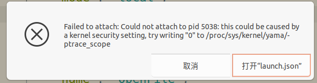

# go 语言使用 dlv 配置 vscode 进行代码端点调试

- [go 语言使用 dlv 配置 vscode 进行代码端点调试](#go-语言使用-dlv-配置-vscode-进行代码端点调试)
  - [1. 安装 dlv](#1-安装-dlv)
    - [1.1 根据官方文档进行安装](#11-根据官方文档进行安装)
    - [1.2 下载官方 dlv 源码，手动编译成静态的二进制文件](#12-下载官方-dlv-源码手动编译成静态的二进制文件)
  - [2. 利用 dlv 调试进程](#2-利用-dlv-调试进程)
    - [2.1 直接本机进程](#21-直接本机进程)
    - [2.2 调试远程进程](#22-调试远程进程)
  - [3. 直接利用 dlv 调试](#3-直接利用-dlv-调试)
    - [3.1 dlv 启动调试方式](#31-dlv-启动调试方式)
    - [3.2 dlv 命令调试的常见命令](#32-dlv-命令调试的常见命令)

## 1. 安装 dlv

### 1.1 根据官方文档进行安装

- https://github.com/go-delve/delve/tree/master/Documentation/installation

```shell
$ git clone https://github.com/go-delve/delve
$ cd delve
$ go install github.com/go-delve/delve/cmd/dlv
```

或者 go 1.16+

```shell
# 安装最新发布版本
$ go install github.com/go-delve/delve/cmd/dlv@latest

# 安装主版本
$ go install github.com/go-delve/delve/cmd/dlv@master

# 安装指定版本
$ go install github.com/go-delve/delve/cmd/dlv@v1.7.3
$ go install github.com/go-delve/delve/cmd/dlv@v1.7.4-0.20211208103735-2f13672765fe
```

### 1.2 下载官方 dlv 源码，手动编译成静态的二进制文件

编译之前务必保证本机的 go 环境正常

```shell
$ wget https://codeload.github.com/go-delve/delve/tar.gz/refs/tags/v1.20.1

$ tar -xzvf delve-1.20.1.tar.gz
$ cd delve-1.20.1
$ go mod tidy
$ cd delve-1.20.1/cmd/dlv
# 全静态编译, 编译后正常会在当前目录中生成一个名为 dlv 的二进制文件
$ go build -gcflags "all=-N -l" -tags netgo -ldflags "-linkmode external -extldflags -static" .

# 以上生成的二进制文件，通过 ldd 查看是否是静态文件
$ ldd dlv
	不是动态可执行文件
# 查看 dlv 版本
./dlv version
```

## 2. 利用 dlv 调试进程

- 利用 vscode 调试进程，必须保证进程使用的代码版本和当前的版本一致，否则将不能成功或调试有问题
- 在go build时，添加参数-gcflags "all=-N -l" 来去掉golang默认的编译期间优化，⽅便调试
- 在 linux 下开启调试时，可能报出一些异常，一般根据提示解决即可

> 已知异常 
```shell
su root
echo 0 > /proc/sys/kernel/yama/ptrace_scope
```

> 要完全静态编译，可以参卡编译命令 `go build -gcflags "all=-N -l" -tags netgo -ldflags "-linkmode external -extldflags -static" -o http http.go`

### 2.1 直接本机进程

步骤:
> 1. 利用代码编译出二进制文件:  `go build -gcflags "all=-N -l" -tags netgo -ldflags "-linkmode external -extldflags -static" -o http http.go`
> 2. 本机启动编译出的二进制: `./http`
> 3. 查看启动进程号: ps -ef | grep http
> 4. 配置 vscode 的 本机 dlv 调试 -> processId
> 5. 启动调试，可以根据需要在 vscode 在本机打断点调试

```json
{
    "version": "0.2.0",
    "configurations": [
        {
            "name": "LocalProcess",
            "type": "go",
            "request": "attach",
            "mode": "local",
            "processId": 5402
        }
    ]
}
```

### 2.2 调试远程进程

步骤:
> 1. 利用代码编译出二进制文件:  `go build -gcflags "all=-N -l" -tags netgo -ldflags "-linkmode external -extldflags -static" -o http http.go`
> 2. 将生成二进制上传到服务器: scp http root@remoteIP:~
> 3. 将 1.2 编译的 dlv 上传到服务器: scp dlv root@remoteIP:~
> 4. 服务器启动二进制: ./http
> 5. 服务器查看启动进程号: ps -ef | grep http
> 6. 服务器启动 dlv-server: `dlv attach 664481 --headless --listen=:8111 --api-version=2 --accept-multiclient`
> 7. 配置 vscode 的 本机 dlv 调试
> 8. 启动调试，可以根据需要在 vscode 在本机打断点调试

```json
{
    "version": "0.2.0",
    "configurations": [
        {
            "name": "RemoteDlv",
            "type": "go",
            "request": "attach",
            "mode": "remote",
            "remotePath": "${workspaceFolder}",
            "port": 8111,
            "host": "192.168.242.253"
        }
    ]
}
```

## 3. 直接利用 dlv 调试

### 3.1 dlv 启动调试方式

- 从源码直接启动
  - 格式: dlv debug [main路径] -- main程序启动参数
- 调试正在运行的程序
  - 格式: dlv attach [进程ID号]
- 从可执行文件启动调试
  - 格式: dlv exec [binary路径] -- binary参数
- 从 core 文件启动
  - 格式: dlv core [可执行文件] [core文件]
- 远程调试
  - 远端启动服务: dlv attach 9713 --headless --listen=:8111 --api-version=2 --accept-multiclient
  - 本机命令行连接: dlv connect 192.168.242.253:8111

### 3.2 dlv 命令调试的常见命令

| 格式                                                | 作⽤                |
| :-------------------------------------------------- | :----------------- |
| b \| break [⽂件名]:[⾏数]                            | 添加断点           |
| c \| continue                                       | 执⾏到下⼀个断点     |
| s \| step                                           | 单步执⾏            |
| grs \| goroutines                                   | 打印所有goroutines |
| gr \| goroutine [goroutine id]                      | 切换当前goroutines |
| bt \| stack                                         | 打印堆栈           |
| l \| list 或 l \| list [⾏数]                        | 显⽰源码内容        |
| p \| print [变量名]                                 | 打印变量           |
| cond \<breakpoint name or id> \<boolean expression> | 给指定断点添加条件 |
| call \<variable> = \<value>                         | 设置变量值         |
| up                                                  | 上移⼀个frame       |
| down                                                | 下移⼀个frame       |
