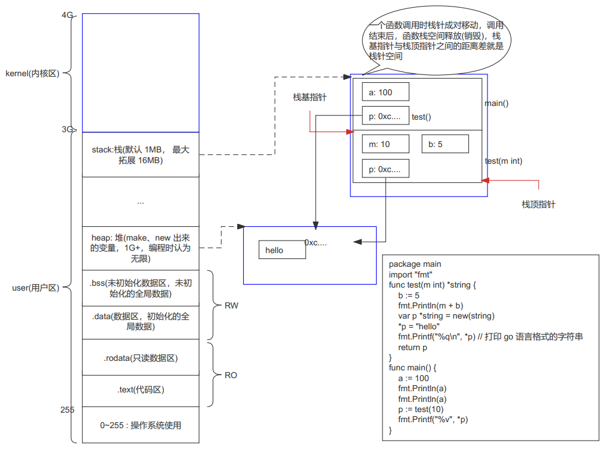
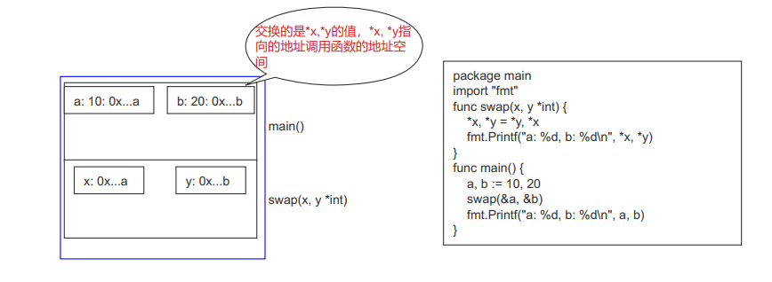

# go 语言的指针

- 指针: 就是地址，指针变量就是存储地址的变量
- *p: 解引用、间接引用
- 通过 p=nil, 通知 gc (垃圾回收机制)
- 栈针
  - 用于给函数运行提供内存空间，区内存与 stack 上
  - 当函数调用时，产生栈针，函数调用时，释放栈针
  - 存储: 1.局部变量; 2.形参; (形参与局部变量存储地位等同)3.内存字段描述值(栈基指针和栈顶指针的地址).
  - 一个应用有两个栈针(栈基指针和栈顶指针)
    - 程序未启动时，栈基指针和栈顶指针指向同一个地址
    - 栈基指针与栈顶指针之间的距离差就是栈针空间
    - 启动main()函数时，栈顶指针开始移动，函数中调用函数时，栈基指针和栈顶指针同时分别向下移动到另一个函数的开始和结束空间地址位置；结束调用时，同时向上移动，并释放该函数空间
    - 应用中栈针分配的内存空间时连续的
  - 指针使用注意
    - 空指针(nil): 未被初始化的指针， var p *int; fmt.Println(p) (runtime error: invalid memory address or nil pointer dereference)
    - 野指针: 被一片无效的地址空间初始化的指针， var p *int = 0; (编译错误，不能编译))

# 1. 解析 32 位系统内存分配

- 32 位机最大内存 4G
- 3G～4G : kernel(内核空间)，硬件的启动程序，启动进程，显卡，声卡，网卡等要工作，都使用这段空间
- 0~3G : user(用户空间)
  - 0~255 : 留给操作系统用，大小几乎不计
  - .text(RO): 代码区
  - .rodata(RO): 只读数据区
  - .data(RW): 数据区(初始化的全局数据)
  - .bss(RW): 未初始化数据区(未初始化的全局数据)
  - heap: 堆(make、new 出来的变量，1G+，编程时认为无限)
  - ?
  - stack: 栈，默认 1MB， 最大拓展 16MB

# 2. 内存和函数调用分配示意图

```go
package main

import "fmt"

func test(m int) *string {
    b := 5
    fmt.Println(m + b)
    var p *string = new(string)
    *p = "hello"
    fmt.Printf("%q\n", *p) // 打印 go 语言格式的字符串
    return p
}
func main() {
    a := 100
    fmt.Println(a)
    fmt.Println(a)
    p := test(10)
    fmt.Printf("%v", *p)
}
```



# 3. 地址引用的swap示意图

```go
package main

import "fmt"

func swap(x, y *int) {
    *x, *y = *y, *x
    fmt.Printf("a: %d, b: %d\n", *x, *y)
}

func main() {
    a, b := 10, 20
    fmt.Printf("a: %p, b: %p\n", &a, &b)
    swap(&a, &b)
    fmt.Printf("a: %p, b: %p\n", &a, &b)
    fmt.Printf("a: %d, b: %d\n", a, b)
}

```


