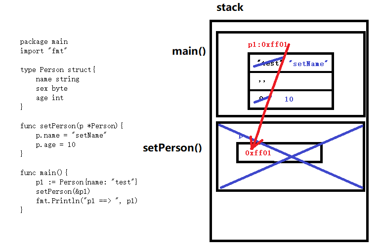
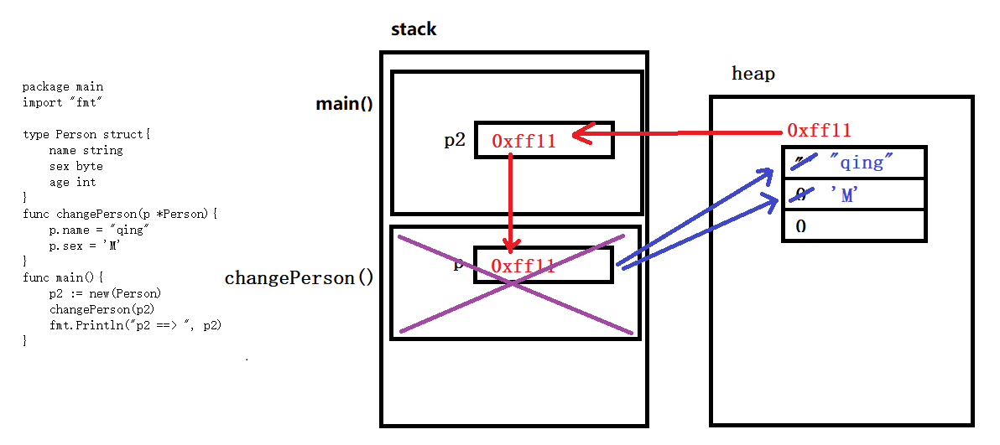
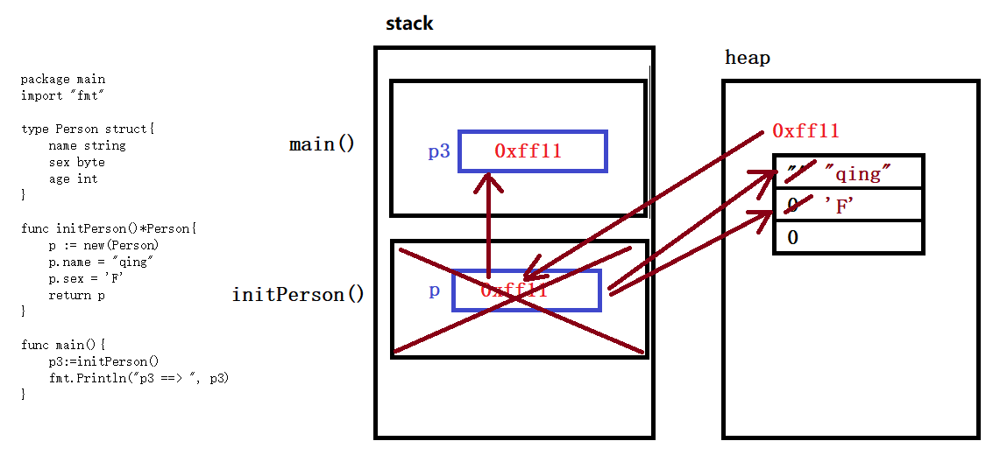

# go 语言中 struct 的使用

## 1. 结构体的使用说明

- 基本说明
  - 结构体是一种数据类型
  - 定义类型时不能给成员赋值
  - 类型定义等加于 int, byte, bool, string...
- 初始化
  - var p3 Person; p3.name = "test": 先申明在赋值
  - 顺序初始化，必须全部成员必须按照顺序全部列出
    - p := Person{"qingbing", 33, 1}
  - 键值对初始化，对于未指定的成员将赋值为零值
    - p := Person{name: "yong",sex:2}
- 结构体地址
  - 结构体变量的地址 == 结构体首个成员的地址
- 使用 "." 索引成员变量
- 结构体的比较
  - 只能使用 == 和 !=, 不能使用 >, <, >=, <=...
  - 结构体的比较实际是比较所有的对应成员
- 结构体赋值
  - 相同类型（成员变量的类型、个数、顺序一致）的结构体之间可以相互赋值，所以，结构体可以作为函数参数
- 结构体作为函数参数
  - 作为函数参数是 "值传递"(将结构体的成员全部统一拷贝赋值，因为内存消耗大，效率比较低，***极少使用***)
- 结构体定义可以嵌套

### 1.1 类型定义

```go
type Person struct{
    name string
    age int
    sex int
}
```

## 2. 结构体指针的使用说明

- 初始化，和结构体初始化基本一致，需要加相应的取址符"&"
  - var ptr *Person = &p; ptr.name = "test"
  - 顺序初始化，必须全部成员必须按照顺序全部列出
    - ptr := &Person{"qingbing", 33, 1}
  - 键值对初始化，对于未指定的成员将赋值为零值
    - ptr := &Person{name: "yong",sex:2}
  - 使用 new 创建，会放在 堆空间(heap)里
    - ptr := new(Person); ptr.name = "test"
- 使用 "." 索引成员变量
- 结构体指针地址
  - 结构体指针变量的值 == 结构体首个成员的地址
- 结构体作为函数参数
  - 作为函数参数是 "传引用" ***使用频率极高***
  - 通过 unSafe.Sizeof(ptr): 不管何种类型的指针，在 64 位系统中大小都是 8 字节

## 3. 结构体函数结构分析

- 函数传递结构体地址



- 函数传递堆(new函数操作空间)地址



- 函数返回堆引用


