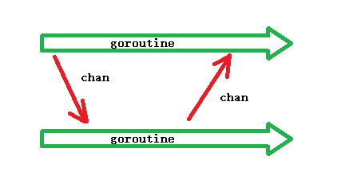

# go 语言中管道 channel 的使用

## 1. channel 说明

- channel 是 go 语言的数据类型
- 主要作用: 用于解决协程之间的同步问题及协程之间的数据共享(数据传输)问题
- goroutine 在数据共享上奉行 "通过通信共享数据，而不是共享内存来通信"
- channel 是引用类型， 可用于多个 goroutine 通讯，内部已实现数据同步，以确保并发安全
- channel 作队列使用时是一种FIFO(First Input First Output)方式的队列



- channel 定义
  - make(chan Type): 无缓冲的通道，相当云 make(chan Type, 0)
  - make(chan Type, capacity): 当 capacity > 0 时，表示 channel 有缓冲，是非阻塞的，直到写满 capacity 个元素才会阻塞写入
- channel 有两个端: 读端和写端必须同时满足条件，才会在 chan 上进行数据流动，否则，都会阻塞
  - 写端(写入): chan &lt;-
  - 读端(读出): &lt;- chan
- channel 支持函数
  - len(ch): channel 内存储(未读)的数据个数
  - cap(ch): channel 的容量, 最大缓冲个数
- 无缓冲 channel——同步通信
  - 通道容量为 0， len = 0， 不能存储数据
  - channel 应用于两个 go 程， 一个读一个写
  - 无缓冲通道具备同步能力: 读写数据同步(比如: 打电话)
- 有缓冲 channel——异步通信
  - 通道容量为 非0; len(ch) 表示 channel 剩余未读数据的个数， cap(ch) 表示通道的容量
  - channel 应用于两个 go 程， 一个读一个写
  - 缓冲区可以进行数据存储，可存储至容量上限，不需要读写同时操作缓冲区，具备异步功能(比如: 发短信)
- 关闭 channel
  - 关闭 channel 使用: close(ch)
  - channel 的关闭一般是针对于发送端
  - 确定不再发送数据的 channel 才能关闭
  - 判断 channel 是否关闭
    - if val, ok := &lt;-; ok {}
      - 写端关闭， ok => false, num 无数据
      - 写端未关闭， ok => true, num 保存读到的数据
    - 可使用 range 替代 ok: for val := range ch { ... }
- channel 关闭总结
  - 数据不发送完毕，不应该关闭通道
  - 已经关闭的通道，不能向其写数据，否则操作报错 "panic: send on closed channel"
  - 写端关闭的channel，可以读取 channel 数据
    - 无缓冲区，写端关闭后，读出的数据为 零值
    - 有缓冲区，写端关闭后，优先将缓冲区的数据读取未完毕，继续读取时读出的数据为 零值
- channel 作为函数传参是 传引用(地址)
- channel 的方向
  - 默认的channel是双向的，即既可以写，也可以读: var ch chan int; ch = make(chan int)
  - 单向 channel
    - 单向写channel: var ch chan \<- int; ch = make(chan\<- int)
    - 单向读channel: var ch \<- chan int; ch = make(\<-chan int)
  - 转换: 
    - 双向 channel 可以转换(赋值)为 单向 channel
    - 单向 channel 不可以转换(赋值)为 双向 channel

## 2. channel 的常用注释

```go
ch := make(chan int)
ch <- 5       // 发送数据到channel
<-ch          // 接收并将 channel 数据丢弃
x := <-ch     // 从 channel 中接收数据，并赋值给 x
x, ok := <-ch // 从 channel 中接收数据，并赋值给 x, 同时检查通道是否关闭或为空
```
